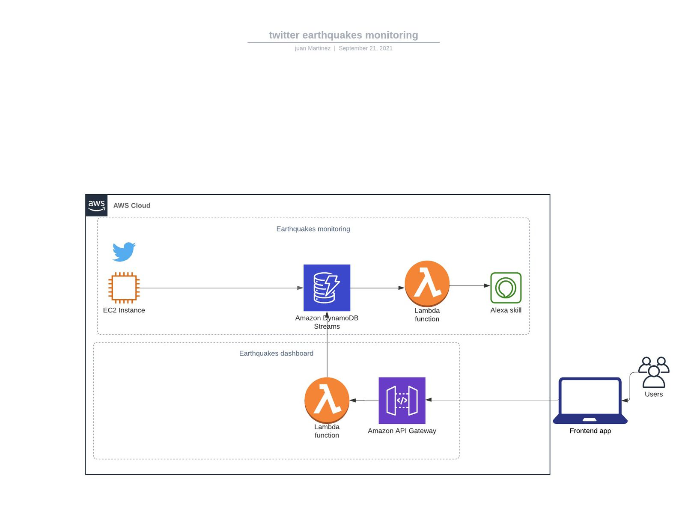

# Mexico City Earthquakes Twitter Monitoring and Alexa Skill

Tweets from SASMEX Twitter account will be monitored, so that when an earthquake occurs that would affect Mexico City and the alarms are activated, we will receive the tweet and process it to AWS DynamoDB using DynamoDB streams so that we would be able to trigger an Alexa skill and also keep track of the events (earthquakes) that have occurred.

Flow Chart of the project:

## Contributing
Pull requests are welcome. For major changes, please open an issue first to discuss what you would like to change.

## License
Jhair Gutiérrez Solís - 2021